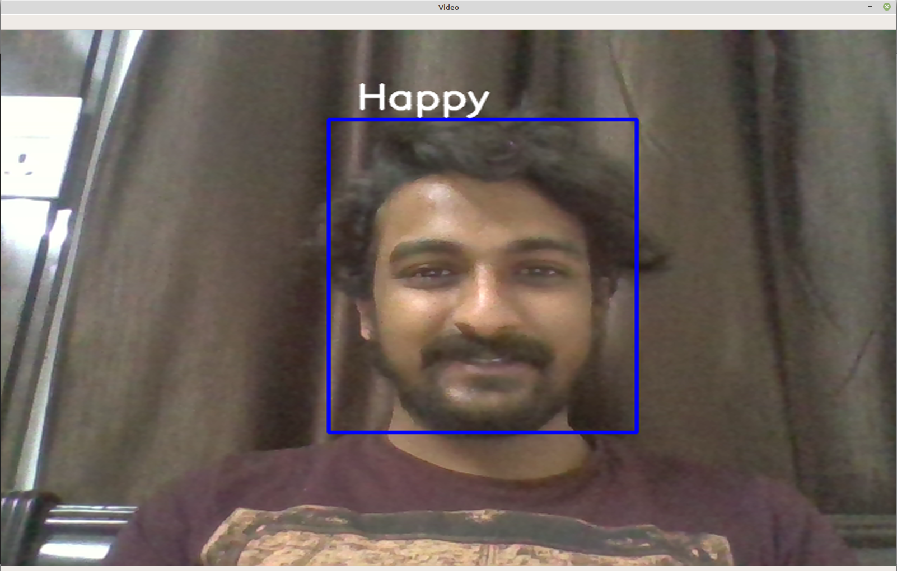
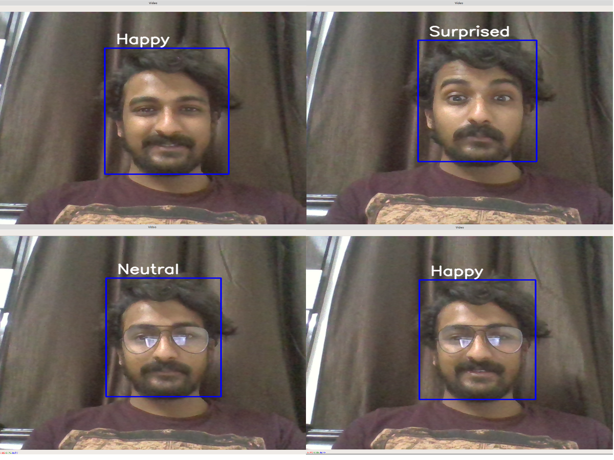

# Emotion-detection

## Introduction

This project aims to classify the emotion on a person's face into one of **seven categories**, using deep convolutional neural networks. This project is an implementation of attached  research paper. The model is trained on the **FER-2013** dataset which was published on International Conference on Machine Learning (ICML). This dataset consists of 35887 grayscale, 48x48 sized face images with **seven emotions** - angry, disgusted, fearful, happy, neutral, sad and surprised.

## Dependencies

* Python 3, [OpenCV](https://opencv.org/), [Tensorflow](https://www.tensorflow.org/)
* To install the required packages, run `pip install -r requirements.txt`.

## Basic Usage
***Note*** .csv file is missing as it is too large to upload.
* I have already trained my model, so for running this project, just run the following commands:  


```bash
cd src
python emotions.py --mode display
```

* The folder structure is of the form:  
  src:
  * data (folder)
  * `emotions.py` (file)
  * `haarcascade_frontalface_default.xml` (file)
  * `model.h5` (file)

* This implementation by default detects emotions on all faces in the webcam feed. With a simple 4-layer CNN, the test accuracy reached 63.2% in 50 epochs.


## Data Preparation (optional)

* The [original FER2013 dataset in Kaggle](https://www.kaggle.com/deadskull7/fer2013) is available as a single csv file. I had converted into a dataset of images in the PNG format for training/testing using  `dataset_prepare.py` file 

## Algorithm

* First, the **haar cascade** method is used to detect faces in each frame of the webcam feed.

* The region of image containing the face is resized to **48x48** and is passed as input to the CNN.

* The network outputs a list of **softmax scores** for the seven classes of emotions.

* The emotion with maximum score is displayed on the screen.

## Requirements
numpy==1.17.4
opencv-python==4.1.2.30
tensorflow==2.1.0


## Example Output



* NOTE :-   For exiting webcam press ‘q’.

## Combined Output for different emotions



## References

* "Challenges in Representation Learning: A report on three machine learning contests." I Goodfellow, D Erhan, PL Carrier, A Courville, M Mirza, B
   Hamner, W Cukierski, Y Tang, DH Lee, Y Zhou, C Ramaiah, F Feng, R Li,  
   X Wang, D Athanasakis, J Shawe-Taylor, M Milakov, J Park, R Ionescu,
   M Popescu, C Grozea, J Bergstra, J Xie, L Romaszko, B Xu, Z Chuang, and
   Y. Bengio. arXiv 2013.
* "Emotion Recognition Using Deep Convolutional Neural Networks." Tamhane, Shubham, et al. Available at SSRN 4096405 (2022).
